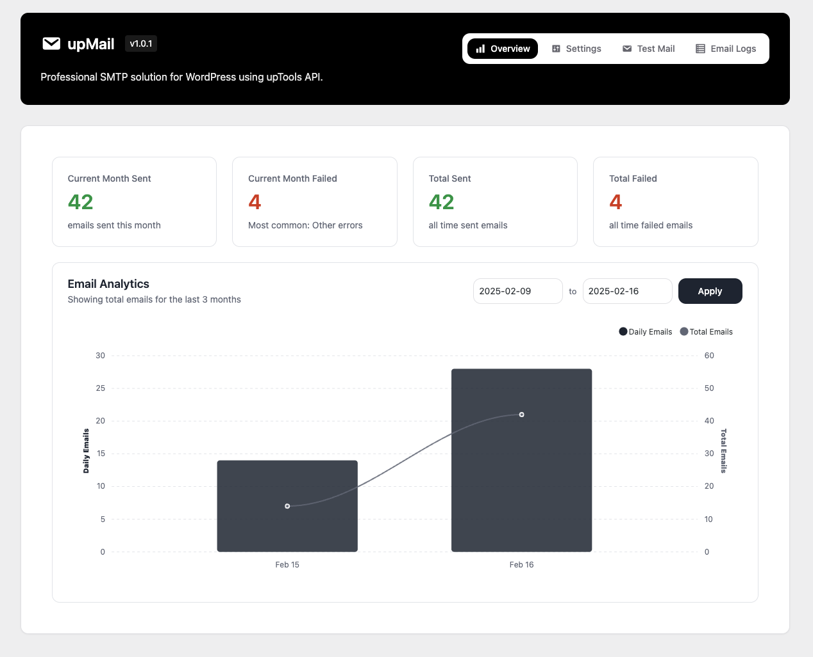

# upMail - Professional SMTP Solution


[](https://opensource.org/licenses/)
[](https://github.com/uptools-io/upmail)

Professional SMTP solution for WordPress using upTools API. Send emails reliably with advanced logging and tracking capabilities.



## 🌟 Features

### Core Functionality
- 📧 Easy setup with API key
- 🚀 Reliable email delivery via upTools SMTP servers
- 📊 Comprehensive email logging and tracking
- ✨ Modern, user-friendly interface
- 🔒 Secure API key storage

### Email Logging
- 📝 Track all sent emails
- 🔍 View detailed email content
- 🏷️ Filter by status (sent/failed)
- 🔎 Advanced search functionality
- 📅 Date range filtering
- 🔄 Resend failed emails
- ⚡ Bulk actions support

### Statistics & Analytics
- 📈 Overview dashboard
- 📊 Monthly statistics
- 📉 Success/failure rates
- 🔍 Detailed error tracking
- 📊 Visual data representation
- 📤 Export capabilities

### Security Features
- 🔐 Encrypted API key storage
- 👥 Role-based access control
- 🛡️ Secure email transmission
- ✅ WordPress security best practices

## 📋 Requirements

- PHP >= 8.0
- WordPress >= 5.0
- upTools API key

## 🚀 Installation

1. Download the latest release from the [releases page](https://github.com/uptools-io/upmail/releases)
2. Upload the plugin files to the `/wp-content/plugins/upmail` directory
3. Activate the plugin through the 'Plugins' screen in WordPress
4. Go to upTools > upMail in the admin menu
5. Enter your upTools API key and configure the settings
6. Send a test email to verify the setup

## ⚙️ Configuration

### API Key Setup
1. Obtain an API key from [upTools](https://uptools.io)
2. Enter the API key in the plugin settings
3. Click "Validate" to verify the API key
4. Configure additional settings as needed

### Email Settings
- Set custom From name and email
- Configure email tracking options
- Set up email retention period
- Customize logging preferences

## 📊 Usage

### Sending Test Emails
1. Navigate to the Test Email tab
2. Enter recipient email address
3. Customize subject and message
4. Send test email
5. Check delivery status

### Viewing Email Logs
1. Go to the Email Logs tab
2. Use filters to find specific emails
3. View detailed email information
4. Resend failed emails if needed
5. Export logs for analysis

### Monitoring Statistics
1. Check the Overview dashboard
2. View success/failure rates
3. Analyze email trends
4. Track delivery performance
5. Export statistics data

## 🔧 Development

### Building from Source
```bash
# Clone the repository
git clone https://github.com/uptools-io/upmail.git
```

## 📝 Changelog

### 1.0.1
- Enhanced email statistics visualization
- Added cumulative email tracking
- Improved mobile responsiveness
- Updated UI with modern design
- Fixed various minor bugs

### 1.0.0
- Initial release with core functionality
- Email logging and tracking system
- Statistics dashboard
- Security features
- Modern admin interface

## 🤝 Contributing

Contributions, issues and feature requests are welcome!

1. Fork the repository
2. Create your feature branch (`git checkout -b feature/amazing-feature`)
3. Commit your changes (`git commit -m 'Add some amazing feature'`)
4. Push to the branch (`git push origin feature/amazing-feature`)
5. Open a Pull Request

## 📜 License

Copyright © 2025 [upTools](https://uptools.io).

This project is licensed under the GPLv2 License - see the [LICENSE](LICENSE) file for details.

## 📚 Documentation

Documentation is available in our [GitHub repository](https://github.com/uptools-io/upmail).

## 🆘 Support

For support, please create an issue in our [GitHub repository](https://github.com/uptools-io/upmail/issues). 